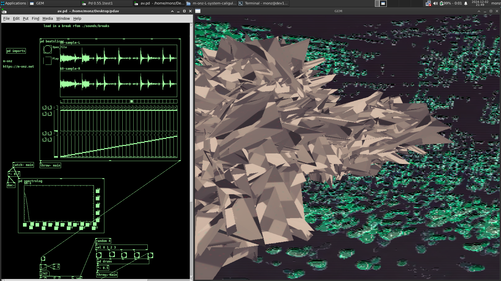

# pdav

m-onz AV set & patches for pure data (Pd) & GEM.

# installation

* relies on Pd vanilla. Ideally above v53 for the list object
* clone or download; https://github.com/algomusic/Live-Coding-Toolkit-for-Pure-Data & add to the path via Pd settings.
* should work out of the box apart from that and includes video's and sounds.

Also check out my guide to installing Pd and GEM from source: https://m-onz.net/installing-pure-data-and-gem if the one in your package manager doesn't include the list object.

# misc

* There is a folder related to extracting MIDI notes from a DAW; See this https://m-onz.net/algorithmic-process for more info on that.
* There are some scripts for chunking audio and splitting .wavs obtained from anywhere including via udio.com ai stems
* The patch includes a timbre stamping patch that will tune the sounds inline with the current chords in a simple approach to avoiding dissonance.
